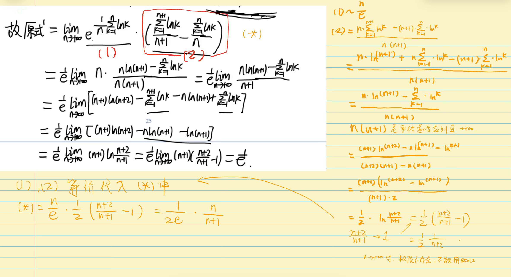
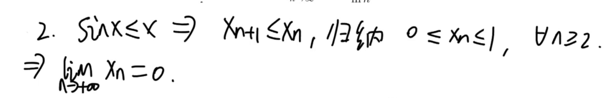
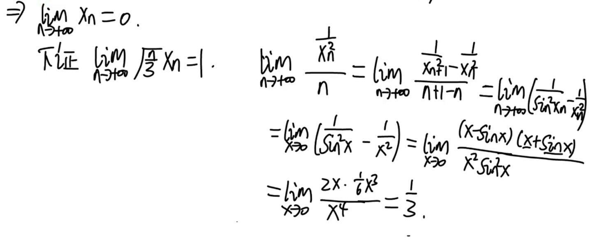
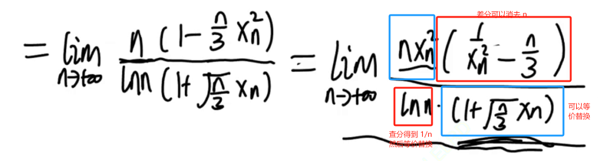
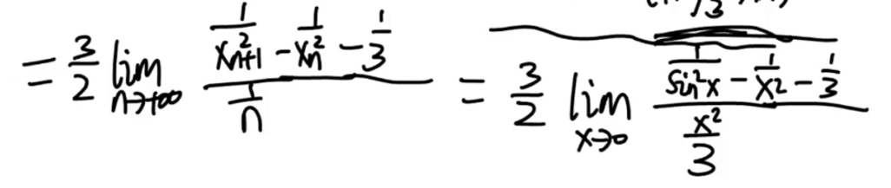
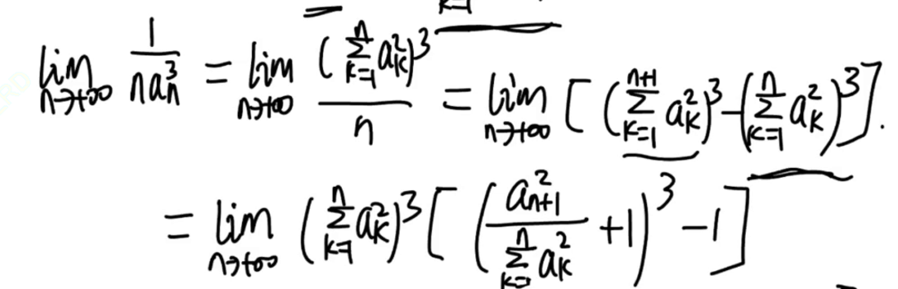
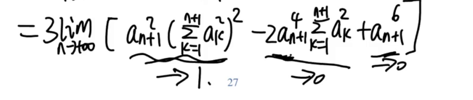

---
tags:
  - 考研
  - math
---
## Stolz定理

如果 分子 $x_n$ 是严格递增数列且满足 $\lim_{n \to \infty} x_n = +\infty$ 则

$$\varliminf_{n\to\infty}\frac{y_{n+1}-y_{n}}{x_{n+1}-x_{n}}\leqslant\varliminf_{n\to\infty}\frac{y_{n}}{x_{n}}\leqslant\varlimsup_{n\to\infty}\frac{y_{n}}{x_{n}}\leqslant\varlimsup_{n\to\infty}\frac{y_{n+1}-y_{n}}{x_{n+1}-x_{n}}.$$

如果 分子 $x_n$ 是严格递减数列 且 满足 $\lim_{n \to \infty} x_n = \lim_{y \to \infty} y_n = 0$ 则

$$\varliminf_{n\to\infty}\frac{y_{n+1}-y_{n}}{x_{n+1}-x_{n}}\leqslant\varliminf_{n\to\infty}\frac{y_{n}}{x_{n}}\leqslant\varlimsup_{n\to\infty}\frac{y_{n}}{x_{n}}\leqslant\varlimsup_{n\to\infty}\frac{y_{n+1}-y_{n}}{x_{n+1}-x_{n}}.$$

在上面的基础上，如果 $\lim_{n \to \infty} \frac{y_{n+1}- y_n}{x_{n+1} - x_n}$ 存在或者为确定符号的 $\infty$, 则

$$\lim_{n\to\infty}\frac{y_{n}}{x_{n}}=\lim_{n\to\infty}\frac{y_{n+1}-y_{n}}{x_{n+1}-x_{n}}.$$

> 最直接的应用在于，抵消和式的降阶：$\lim_{n \to \infty} \frac{y_1 + y_2 + \cdots  y_n}{n} = \lim_{n \to \infty} y_n$

对于交错数列，分奇偶震荡而整体上不符合条件的式子，可以分奇偶子列讨论。[[数列分析#^ika9z6|交错分奇偶子列]]
## 例题 3.14

$$
\lim_{n \to \infty} \frac{\ln n}{\ln \sum_{k=1}^{n} k^{2020}}
$$

求和式是难点，考虑Stolz消掉，但是求和式没有现成的分式结构，但观察 到 $\ln$，先用一次 Stolz 就可以得到 分式结构（分子和分母有一个是即可）

$$
\begin{equation}
\lim_{n \to \infty} \frac{\ln(n+1) - \ln n}{\ln \sum_{k=1}^{n+1}k^{2020} - \ln \sum_{k=1}^{n} k^{2020}} = \lim_{n \to \infty} \frac{\frac{1}{n}}{\ln \frac{\sum^{n+1} K^{2020}}{\sum^{n} k^{2020}}}
\end{equation}
$$

其中 $\lim_{n \to \infty}\frac{\sum^{n+1} k^{2020}}{\sum^{n}k^{2020}} = \lim_{n \to \infty}\frac{(n+2)^{2020}}{(n+1)^{2020}} = 1$，但是就得到了 分子分母 $\frac{0}{0}$ 的结构，这就要细致的分析 阶了。

那么回到 式 1，我们还是考虑 $\ln$ 的 展开：

$$
\begin{equation}
RHS = \lim_{n \to \infty} \frac{\frac{1}{n}}{\ln(1+ \frac{(n+1)^{2020}}{\sum^{n}K^{2020}})}
\end{equation}
$$

其中 $\lim_{n \to \infty} \frac{(n+1)^{2020}}{\sum^{n} K^{2020}} = \lim_{n \to \infty} \frac{(n+2)^{2020} - (n+1)^{2020}}{(n+1)^{2020}} = \lim_{n \to \infty} \frac{2020(n+2)^{2019}}{(n+1)^{2020}} = 0$

那么

$$
(2) = \lim_{n \to \infty} \frac{\frac{1}{n}}{\frac{(n+1)^{2020}}{\sum^{n} K^{2020}}} = \lim_{n \to \infty} \frac{\sum^{n}k^{2020}}{n\cdot (n+1)^{2020}} = \lim_{n \to \infty} \frac{(n+1)^{2020}}{(n+1)^{2021}- n^{2021}} = \frac{n^{2020}}{2021 n^{2020}} = \frac{1}{2021}
$$

## 例题 3.15

1. 计算极限 $\lim_{n \to \infty} \frac{\sum \frac{1}{k}}{\ln n}$

分子严格递增，趋向 $+\infty$
$$
RHS = \frac{\frac{1}{n+1}}{\ln \frac{n+1}{n}} = \frac{n}{n+1} = 1
$$

2. 证明下列极限存在

$$
\lim_{n \to \infty} (\sum \frac{1}{k} - \ln n)
$$

对相邻两项的差 做 渐近分析 

$$
c_{n} = \sum \frac{1}{k} - \ln n \\
c_{n+1} - c_n = \frac{1}{n+1} - \ln(1+\frac{1}{n}) = \frac{1}{n+1} - \frac{1}{n} + O(\frac{1}{n^{2}}) = \frac{1}{n(n+1)} + O(\frac{1}{n^{2}}) = O(\frac{1}{n^{2}}) \\
\therefore \lim_{n \to \infty}|\frac{c_{n+1} - c_n}{\frac{1}{n^{2}}}| = C \rightarrow \lim_{n \to \infty} |c_{n+1} - c_n| = \frac{C}{n^{2}} \\
\therefore \sum |c_{j+1} - c_{j}| \le +\infty \rightarrow c_{n+1} - c_n 绝对收敛 \rightarrow c_{n+1} - c_n 条件收敛 即 \sum (c_{n+1} - c_n) 存在 
$$

3. 计算 
$$
\lim_{n \to \infty} n(\sum \frac{1}{k} - \ln n - \gamma)
$$

乘法也是除法

$$
RHS = \lim_{n \to \infty} \frac{\sum \frac{1}{k} -\ln n - \gamma}{\frac{1}{n}} \\
\frac{1}{n} 递减趋于零，\gamma \triangleq \lim_{n \to \infty}(\sum \frac{1}{k} - \ln n)   \\
\therefore RHS = \lim_{n \to \infty} \frac{\frac{1}{n+1} - \ln(1+\frac{1}{n})}{\frac{1}{n+1} - \frac{1}{n}} = \lim_{n \to \infty}-n^{2}[\frac{1}{n+1} - \frac{1}{n} + \frac{1}{2n^{2} } + o(\frac{1}{n^{2}})] = \lim_{n \to \infty}  [\frac{1}{2} + n^{2}o(\frac{1}{n^{2}}) ] = \frac{1}{2}
$$

## 例题 3.17
1. $\lim_{n \to \infty} \frac{\sqrt[n]{n!}}{n}$

变形得到

$$
\frac{\sqrt[n]{n!}}{n} = e^{\ln (n!)^{\frac{1}{n}}  - \ln n} 
$$

由于 $\lim e^{\Box} = e^{\lim \Box}$ 下面分析 $\lim_{ n \to \infty}e^{\ln (n!)^{\frac{1}{n}}  - \ln n}$

$$
RHS = \lim_{n \to \infty}\frac{\sum \ln k -n \ln n}{n} = \lim_{n \to \infty}[\ln(k+1) - (n+1) \ln(n+1) + n \ln n] = \lim_{ n \to \infty} -n(\ln(n+1) - \ln n) = -1
$$

所以 我们 能得到

$$
\lim_{n \to \infty}\frac{\sqrt[n]{n!}}{n} = e^{-1} \rightarrow  \sqrt[n]{n!} \sim \frac{n}{e}, n \to \infty
$$

> 📚简单版本的斯特林公式 

1. $\lim_{n \to \infty} (\sqrt[n+1]{(n+1)!} - \sqrt[n]{n!})$

分开变形

$$
e^{\frac{\sum^{n+1} \ln k}{n+1}} - e^{\frac{\sum^{n} k}{n}} = e^{\frac{\sum^{n} \ln k}{n}} [e^{\frac{\sum^{n+1} \ln k}{n+1} - \frac{\sum^{n} \ln k}{n} } - 1] = e^{\frac{\sum^{n} \ln k}{n}} \cdot  [\frac{\sum^{n+1} \ln k}{n+1} - \frac{\sum^{n} \ln k}{n}] = e^{\frac{\sum^{n} \ln k}{n}} \cdot \frac{n \ln(n+1) - \sum^{n} \ln k}{n(n+1)} \\
\because e^{\frac{\sum^{n} \ln k}{n}} \sim  \frac{n}{e} \\
\therefore \lim_{ n \to \infty}RHS= \lim_{n \to \infty} \frac{n}{e}\frac{n \ln(n+1) - \sum^{n} \ln k}{n(n+1)}  = \lim_{n \to \infty} \frac{1}{e} \frac{n \ln(n+1) -\sum^{n} \ln k}{n+1} = \lim_{n \to \infty} \frac{1}{e} \frac{(n+1)(\ln (n+2) - \ln (n+1)) }{n+2 - (n+1)} =  \frac{1}{e} \lim_{n \to \infty} (n+1)(\frac{n+2}{n+1}-1) = \frac{1}{e}
$$

注意 使用 $stolz$ 定理一定要检查 最后的 得到的 差分比 极限是否存在：

这里 如果对（2）先进行 $stolz$ 求 等价量代入得到 $(2) = \frac{1}{2(n+2)} \to +\infty, n \to \infty$ 极限不存在，不能使用 $stolz$

## 例题 3.16

$$\lim_{n\to\infty}\frac{\sum_{k=1}^{n} \ln C_{n}^{k}}{n^2}.$$

> tips: 组合数性质

## 例题 3.18

> [!tips]+ :[[数列分析]]
> 突破的方向是统一到$a_{n}$ ，不再出现$n$，办法是：
> 1. 是找到$n,a_{n}$之间的等价关系
> 2. stolz 将  消掉，转化为函数极限 那之间使用的估阶的方法就可以完全利用
> 难题需要变形，关键思想在于 将 $n$ 分离 出来 这样$stolz$查分就能够消掉
> 同时也要观察思考，是否存在$f(n) \sim  x_n$

1. 设 $x_{n+1} = \ln(1+x_n), n =1,2, \ldots ,x_1 > 0$ 计算 $\lim_{n \to \infty} \frac{n(n x_n -2)}{\ln n}$

拿到题目，最先 分析 数列 形态，也非常简单

$$
x_{n+1} = \ln(1+x_n) < x_n\\
x_n > 0 时 x_{n+1} = \ln(1+x_n) > 0 又 x_{1} > 0, 故 x_n > 0
$$

单调递减有下界，因此数列极限存在 记为 $a$，又 $\lim_{n \to \infty} x_{n+1} = a = \lim_{n \to \infty}(\ln(1+a_n)) = \ln(1+a) \rightarrow a = 0$

再观察 $\frac{n(n x_n -2)}{\ln n}$，如果极限存在 $\frac{n}{\ln n} \to \infty$，因此 $n x_n \to 2$，下证：

关键在于分离 $n$：

$$
\begin{align}
\lim_{n \to \infty} n x_n  & = \lim_{n \to \infty} \frac{n}{\frac{1}{x_n}}  \\
\frac{1}{x_n} 严格递增 并且  & \to \infty \\
up  & = \lim_{n \to \infty}\frac{1}{\frac{1}{x_{n+1}} - \frac{1}{x_n}}  \\
 & = \lim_{n \to \infty}\frac{x_{n+1}\cdot x_n}{x_n - x_{n+1}}  \\
 & = \lim_{n \to \infty} \frac{\ln(x_n +1) x_n}{x_n - \ln(x_n +1)} \\
转为函数极限
\lim_{x \to 0} \frac{\ln(x +1) x}{x - \ln(x+1)  }  & = \lim_{x \to 0} \frac{(x) \cdot x}{x - (x - \frac{1}{2}x^{2})} = \lim_{x \to 0} \frac{x^{2}}{\frac{1}{2} x^{2}} = 2
\end{align}
$$

因此 我们的到了 一个等价量，尝试分离 $\lim_{n \to \infty} \frac{n(n x_n -2)}{\ln n}$

$$
\begin{align}
\lim_{n \to \infty} \frac{n x_n (n - \frac{2}{x_n})}{\ln n}  & = 2 \lim_{n \to \infty}\frac{n-\frac{2}{x_n}}{\ln n }  \\
 & =  2 \lim_{n \to \infty} \frac{1 - \frac{2}{x_{n+1}} + \frac{2}{x_n}}{\ln(n+1) - \ln n}  \\
 & = 2 \lim_{n \to \infty} \frac{1 - \frac{2}{x_{n+1}} + \frac{2}{x_n} }{\ln(1+\frac{1}{n})}  \\
 & = 2\lim_{n \to \infty} \frac{1 - \frac{2}{x_{n+1}} + \frac{2}{x_n}}{\frac{1}{n}}
\end{align}
$$

我们已经找到了 $n x_n \sim 2$ 的等价，又成功把 $n$ 分离出来了，就直接 等价替换了

$$
\begin{align}
up  & = 2\lim_{n \to \infty} \frac{1 - \frac{2}{x_{n+1}} + \frac{2}{x_n}}{\frac{x_n}{2}}  \\
 & = 2\lim_{n \to \infty} [1 - \frac{2}{\ln(x_n+1)} + \frac{2}{x_n}] \frac{2}{x_n} \\
\end{align} 
$$

海涅准则转为函数极限得到

$$
\begin{align}
4 \lim_{x \to 0} \frac{x \ln(1+x) - 2 x + 2 \ln(x +1)}{x^{2} \ln(x +1)}  &  = 4 \lim_{x \to 0} \frac{(x+2)(x - \frac{x^{2}}{2} + \frac{x^{3}}{3} + o(x^{3})) - 2x}{x^{3} + x^{2}o(x)}  \\
 & = 4 \lim_{x \to 0} \frac{(\frac{2}{3} - \frac{1}{2})x^{3} + o(x^{3})}{x^{3} + o(x^{3})} = 4 \cdot \frac{1}{6} = \frac{2}{3}
\end{align}
$$

事实上 要求证明的极限 也给出了 $x_n$ 的等价量。

$$
\frac{n(n x_n -2)}{\ln n} = \frac{2}{3} + o(1)
$$

2. $x_{n+1} = \sin x_n, n=1,2, \ldots , x_1 \in (0,\pi)$ 计算 $\lim_{n \to \infty} \frac{n}{\ln n}(1- \sqrt{\frac{n}{3}}x_n)$

首先给出 数列 收敛有界：

同样的 计算 数列 和 项数 的 等价关系：

下面 整理一下 $\lim_{n \to \infty}\frac{n}{\ln n}(1- \sqrt{\frac{n}{3}} x_n )$，目前 $1 - \sqrt{\frac{n}{3}} x_n$ 中的 $n$ 不能替换， 想办法 分离 $n$ 到其余 地方，或者构造出 查分 能消除的 结构

这里可以使用 有理化方法：

这样就可以达到 消去 $n$ 转为函数极限, 首先得到 $\frac{3}{2} \lim_{n \to \infty} \frac{\frac{1}{x_n^{2}} -\frac{n}{3}}{\ln n }$ 然后使用 $stolz$ 消去：

观察到 $\frac{1}{\sin^{2}x}$，我们可以展开 $\sin ^{2} x = x^{2} - \frac{x^{4}}{3} + \frac{2}{45} x^{6} + \cdots$ 可以利用长除法： ^ts6kce

$$
\frac{1}{x^{2} - \frac{x^{4}}{3} + \frac{2}{45} x^{6}} = O\left(x^4\right)+\frac{x^2}{15}+\frac{1}{x^2}+\frac{1}{3}
$$

因此

$$
up = \frac{3}{2} \lim_{x \to 0} \frac{O\left(x^4\right)+\frac{x^2}{15}+\frac{1}{x^2}+\frac{1}{3} - \frac{1}{x^{2}} - \frac{1}{3}}{\frac{x^{2}}{3}} = \frac{3}{2} \cdot  \frac{1}{5} = \frac{3}{10}
$$

## 例题 3.19

设 $\lim_{n \to \infty} a_n \sum_{k=1}^{n} a_k^{2} = 1$，计算 $\lim_{n \to \infty} \sqrt[3]{n} a_n$

首先分析 数列的 性质：

显然 当 $n$ 充分大，$a_n > 0$ ，这意味着 $\sum^{n+1} a_k^{2}   - \sum^{n} a_k^{2} = a_n^{2} > 0 \rightarrow \{ \sum^{n} a_k^{2} \} \uparrow$

事实上 $a_n \sum a_k^{2}$ 极限存在，猜测 $\sum a_k^{2} \to +\infty$ $a_n \to 0$，使用反证法

----
若 $\lim_{n \to \infty}a_n \neq 0$ 或者不存在，那么 $\lim_{ n \to \infty} a_k^{2} = +\infty$ 

我们再次通过反证法说明该结论。若 $\sum a_k^{2} \to c$ 则推出 $\sum^{n+1} a_k^{2} - \sum^{n} a_k^{2} = a_{n+1}^{2} \to c - c = 0$，矛盾。因此 $\lim_{n \to \infty} \sum^{n} a_k^{2} = + \infty$

又有 $\lim_{n \to \infty} a_n \sum^{n} a_k^{2}$ 存在，故而直接推出 $\lim_{n \to \infty} a_n = 0$ 矛盾。

因此 $\lim_{n \to \infty} a_n = 0$

----

我们再回到 给出的极限，他实际说明了 一个 等价关系 $a_n \sim  \frac{1}{\sum a_k^{2}}, n \to +\infty$

有了这些 前置的结论 我们接下来需要将 所求极限 转为函数极限（等价替换、stolz定理）.不妨先求解 $\lim_{n \to \infty} \frac{1}{n a_n^{3}}$

最后一个等号用到了 $\frac{s_{n+1}}{s_n} = \frac{x_{n+1} + s_n}{s_n} = 1 + \frac{x_{n+1}}{s_n}$ 

此时可以分析到 $\frac{a_{n+1}^{2}}{\sum^{n} a_k^{2}} \to n$ 因此 

## 函数stolz

如果直接运用函数的stolz定理 并不允许，要么详细论述，这样太耗费时间。我们给出一种可行的解题办法。

设 $\alpha> -1$ ,计算
$$
\lim_{x \to +\infty} \frac{\int_0^x t^\alpha |\sin t| dt}{x^{\alpha+1}}
$$

这里需要说明[[洛必达]]并不解决这个问题，我们直接洛必达得到：
$$
\lim_{ x \to \infty } \frac{|\sin x|}{\alpha+1}
$$
他是一个震荡的结果，因此我们不能保证原函数的极限如何。应用stolz定理的关键是找到一个跨度构建前后两项想减，对于积分的三角函数，我们总是希望，上下限是一个周期，这样就和$x$ 没有关系了：也就是
$$
\int _{x}^{x+\pi} t^{\alpha} |\sin t| dt =
\theta ^{\alpha} \int _{x}^{x+\pi} |\sin t| dt, \theta \in (x,x+\pi) = \theta ^{\alpha} \int _{0}^{\pi}|\sin t| dt = 2 \theta ^{\alpha}
$$
因此我们尝试构建：
$$
\text{original} = \frac{ \theta ^{\alpha} \int _{0}^{\pi}|\sin t| dt}{(x+\pi)^{\alpha+1} - x^{\alpha}}
$$
分母使用常规的拉中简化得到，中值直接夹逼：
$$
[x+\pi -x] (\alpha +1)x^{\alpha} = \pi (\alpha + 1) x^{\alpha}
$$
原式等于
$$
\lim_{ x \to \infty } \frac{2\theta ^{\alpha}}{\pi (\alpha+1) x^{\alpha}}
$$
$\theta \in (x,x+\pi)$ ，当 $x\to \infty, \frac{\theta}{x}\to 1$ ,因此：
$$
\lim_{ x \to \infty }  \frac{2 x^{\alpha}}{\pi(\alpha+1)x^{\alpha}} = \frac{2}{\pi (\alpha+1)}
$$
但是上面没有说明如何为什么我们的函数形式的stolz可以使用。我们的思路时，通过离散的自然数来表示原式，通过夹逼准则来说明精准的极限值怎么取得：对于每个$x \ge 0$ 存在唯一的 $n \in \mathbb{N}$ ，使得：
$$
x \in [(n-1)\pi, n \pi)
$$
我们有：

$$
\lim_{n \to \infty} \frac{\int_0^{n \pi} t^\alpha |\sin t| dt}{(n-1)^{\alpha+1} \pi^{\alpha+1}} 
\ge \lim_{x \to \infty} \frac{\int_0^x t^\alpha |\sin t| dt}{x^{\alpha+1}} 
\ge \lim_{n \to \infty} \frac{\int_0^{(n-1)\pi} t^\alpha |\sin t| dt}{n^{\alpha+1} \pi^{\alpha+1}}$$

注意到$n^{\alpha+1} \sim (n-1)^{\alpha+1}, n \to \infty$, 故只需计算
$$
\frac{1}{\pi^{\alpha+1}} \lim_{n \to \infty} \frac{\int_0^{n\pi} t^\alpha |\sin t|dt} {n^{\alpha+1}} 
$$
这里的 自然数 能够使得我们自然的使用stolz定理，我们先将上面的积分分开成数列模式。我们先计算夹逼的左边，注意到：

$$
LHR = \frac{1}{\pi ^{\alpha+1}}\lim_{ n \to \infty } \frac{\sum _{k=1}^{n} \int _{(k-1)\pi}^{k\pi} t^{\alpha}|\sin t| dt } {n^{\alpha+1}}
$$

这里需要强调的是，我们通过区间的分割已经把变上限积分转换为了无穷个定积分相加，因此这里我们只需要换元即可：  ^nvhkt0

$$
\sum _{k=1}^{n} \int _{(k-1)\pi} ^{k\pi} t^{\alpha}|\sin t|dt = \sum _{k=1}^{n} \int _{0}^{\pi}[t+(k-1)\pi]^{\alpha}|\sin t|dt
$$
当然也可以直接做stolz 就可以得到：
$$
\frac{1}{\pi ^{\alpha+1}} \lim_{ n \to \infty } \frac{\int _{(k-1)\pi}^{k\pi}t^{\alpha}|\sin t|dt}{n^{\alpha+1}} = \frac{1}{\pi ^{\alpha+1}} \lim_{ n \to \infty } \frac{(n\pi)^{\alpha} \int _{(k-1)\pi}^{k\pi}|\sin t|dt}{n^{\alpha+1}} = \frac{1}{\pi ^{\alpha+1}} \lim_{ n \to \infty } \frac{(n\pi)^{\alpha} \int _{0}^{\pi}|\sin t|dt}{n^{\alpha+1}} 
$$
$$
=\frac{1}{\pi ^{\alpha+1}} \lim_{ n \to \infty } \frac{(n\pi)^{\alpha} 2}{(\alpha +1)n^{\alpha}} = \frac{2}{\pi(a+1)}
$$
在同理的计算另一边的极限，我们就能够夹逼出极限了。