---
tags:
  - 考研
  - math
  - "#cheatsheet"
abstract: 作为极限的基础办法的cheatsheet，提供估阶的思路，并且提供
---
# 阶的估计，渐近分析：从泰勒分解的余项出发

> landau 符号 只是 $\epsilon, \delta, N$ 的一种书写方法，在逐项估计当中他能够发回简化作用。考试中应该规避余项书写，而是作为探路方法，最后回归到定义上的书写。
> 所有的余项展开应该到多项式层级，而不是还有其它的函数在

设 $f$ 在 $x=a$ 处有泰勒展开：
$$f\left(x\right)=\quad\sum_{k=0}^{n}\frac{f^{(k)}\left(a\right)}{k!}\left(x-a\right)^{k}+o\left(\left(x-a\right)^{n}\right),x\to a^{+}.$$$$f\left(x\right)=\quad\sum_{k=0}^{n-1}\frac{f^{(k)}\left(a\right)}{k!}\left(x-a\right)^{k}+O\left(\left(x-a\right)^{n}\right),x\to a^{+}.$$
进一步的我们有Taylor展开的拉格朗日余项，他精确的给出了和被逼近的函数全局上的差距：
$$R_n(x) = \frac{f^{(n)}(\xi)}{n!}(x-a)^n$$
其中 $\xi$ 是介于 $a$ 和 $x$ 之间的某个值。完整的带有拉格朗日余项的泰勒公式为：
$$f(x) = \sum_{k=0}^{n-1}\frac{f^{(k)}(a)}{k!}(x-a)^k + \frac{f^{(n)}(\xi)}{n!}(x-a)^n$$

拉格朗日余项的意义在于，我们通常研究$x = a$ 时候展开，这时候我们可以通过Peano余项来控制逼近的次数。但是我们想要研究 $x \neq a$  时候函数和被估计函数之间的差距就可以使用，他定义了给定位置的展开程度的精确误差。也就是$R_{n}(f,a)$ 。这意味着我们可以展开任意一个 $f(a)$ 。 

比如对于 $e^{x}$ 在 $x = 1$ 处展开并且携带拉格朗日余项：

$$
e = f(1) + f'(1)(x-1) + \frac{f''(1)}{2!}(x-1)^{2} + \frac{f^{(3)}(\xi)}{3!}(x-1)^{3} 
$$

其中，当 $\lim \frac{f}{g} = 0$ 时，$f = o(g)$; 当 $|f| \leq C|g|$ 时，$f = O(g)$. $o((x-a)^n)$、$O((x-a)^n)$ 是 $\text{Tarlor}$ 展开的余项。那么使用泰勒公式的时候，$O$余项可以把阶增大一点，会更加简洁。这里的取舍是估阶的判断，求极限时候我们期望使用 估计得到：
$$
f(x) = A + o(1)
$$
>[!note] 证明余项展开
>只需要回归到余项定义写出极限式，再使用洛必达公式验证即可。这里需要注意的是 $n$ 阶可微 只能说明 $f^{(n)}_{+}(a)$ 存在,但是不能保证在其 $x=a$ 的 右邻域中处处存在，不能保证 $\lim_{x \to a^{+}} f^{(n)}(x)$ 存在. 但是 $n-1$ 阶是可以的。

可以理解，余项是满足定义的多项式。比如上面的 $o((x-a)^n)$ 是 后续的泰勒展开项，同时满足 $lim_{x \to a} \frac{f}{o((x-a)^n)} = 0$。同时，我们可以直接回归定义理解，需要说明这才是Landau符号严谨性的关键。如果我们说 $f(x) = o(1)$，这实际上说明了，对于任意 $\epsilon > 0$ there is a $N_{\epsilon}$ , for all $x > N_{\epsilon}$ the $f(x) < \epsilon \times 1$ 。

> [!attention] 非法的余项操作将万劫不复
> 只能回到定义上操作, 不能积分不能求导. 余项不提供解决问题的方法, 只简化书写. 余项只能在你知道如何不用余项书写时才能用余项书写. 余项表述有时候会产生歧义. 初学者用余项的时候, 每时每刻都必须验证余项是否正确. 余项还以由极限定义。

## 例题 什么是等价替换，如何利用估计出来的阶

设 $\lim_{n \to \infty} \frac{f(n)}{n} = 1$, 计算

$$
\lim_{n \to \infty} \:( 1+ \frac{1}{f(n)}\:)^{n}
$$

tips: 指数项出现 $x$ 时，直接考虑指数变形： $e^{n\ln(1+\frac{1}{f(n)})}$ 考虑对数函数的等价替换。

显然， $f(n) = O(n)$, 当 $n \to \infty$, $f(n) \to \infty$, 所以 $\ln(1+\frac{1}{f(n)}) \sim \frac{1}{f(n)}$ 因此原式等于：

$$
e^{\lim_{n \to \infty}\frac{n}{f(n)}} = e^{\lim_{n \to \infty}\frac{1}{\frac{f(n)}{n}}} = e^1 = e
$$

我们可以从阶的估计的角度来解释，进一步理解阶的估计的效果：

$$
\lim_{n \to \infty} \frac{f(n)}{n} = 1 \Rightarrow \lim_{n \to \infty} \frac{\frac{f(n)}{n} -1 }{1} = 0 \Rightarrow \frac{f(n)}{n} - 1 = o(1) 
$$

那么，如果将 $o(1)$ 理解为余项。事实上是可以代入原式的: 

$$
\lim_{n \to \infty}(1+\frac{1}{f(n)})^{n} = \lim_{n \to \infty}(1+\frac{1}{n+n \cdot o(1)})^{n}
$$

由定义 $o(1)$ 是 $\to \infty$ 时的无穷小量，继续的我们有：

$$
up = \lim_{n \to \infty} (1+\frac{1}{n} \frac{1}{1+o(1)})^{n}
$$

其中：

$$
\lim_{n \to \infty} \frac{1}{1+o(1)} = 1 \Rightarrow \frac{1}{1+o(1)} = O(1) = 1+ o(1)
$$

继续说明 $\frac{1}{n} o(1) = o(\frac{1}{n})$：

$$
\lim_{n \to \infty} \frac{\frac{1}{n} o(1)}{\frac{1}{n}} = o(1) = 0 \Rightarrow \frac{1}{n} o(1) = o(\frac{1}{n})
$$ 

因此我们可以得到：

$$
up = \lim_{n \to \infty} (1+\frac{1}{n}(1+o(1)))^{n} = \lim_{n \to \infty} [1+\frac{1}{n} + o(\frac{1}{n})]^{n} = e^{n \ln[1+\frac{1}{n}+o(\frac{1}{n})]} \xrightarrow{\ln(1+ \Box) \sim \Box \quad when \Box \to 0} e^{n(\frac{1}{n} + o(\frac{1}{n}))} = e^{1+n \cdot o(\frac{1}{n})}
$$

说明 $n \cdot o(\frac{1}{n}) = o(1)$

$$
\iff \lim_{n \to \infty} \frac{n \cdot o(\frac{1}{n})}{1} = 0 \quad \text{考虑到}o(\frac{1}{n}) \text{的性质，转换为} \iff  \lim_{n \to  \infty} \frac{n \cdot o(\frac{1}{n})}{\frac{1}{n}} \cdot \frac{1}{n} \text{根据性质该式成立。}
$$

因此

$$
up = e^{1+n(1)} = e
$$

这时候我们回到$\lim_{n \to \infty}\frac{f(n)}{n} = 1$。

>[! attention] 等价替换的本质是极限的四则运算
> 在计算的时候 通过四则运算，除一项再乘一项凑出这个整体项 我们可以把这个整体 代入到极限 中 再消去 就是 所谓的 等价替换。比如
>$$
> \lim_{x \to 0} \frac{1-\cos x}{x^{2}} = \lim_{x \to 0} \frac{1-\cos x}{\frac{1}{2}x^{2}} \frac{\frac{1}{2}x^{2}}{x^{2}} \overset{这个等号能不能成立是等价的关键}{=} \lim_{x \to 0} \frac{1-\cos x}{\frac{1}{2} x^{2}} \cdot  \lim_{x \to 0} \frac{\frac{1}{2} x^{2}}{x^{2}} = \frac{1}{2}
> $$
> 能不能等价就要思考能不能把极限符号放到这里。

## 例题 估计展开程度，怎么估阶
1. $\lim_{x \to 0} \frac{e^{x}-\cos x - x}{x^{2}}$

由于分母的二阶的，并且 $\cos x$，可以统一估到二阶：

$$
e^{x} -\cos x -x = 1 + x + \frac{x^{2}}{2} + o(x^{2}) - (1 - \frac{x^{2}}{2} + o( x^{2})) -x  = x^{2} + o(x^{2}) -o(x^{2})
$$

因此原式等价于于：

$$
\lim_{x \to 0} \frac{x^{2}+ o(x^{2}+ o(x^{2}))}{x^{2}} = 1 + \frac{o(x_2)}{x^{2}} - \frac{o(x^{2})}{x^{2}} \to 1
$$

2. $\lim_{x \to 0}\frac{e^{\tan x - e^{\arctan x}}}{x^{3}}$

tips: 遇到两个指数相减，把一个指数提出来，这样可以 使用 等价无穷小。

$$
e^{\tan x} - e^{\arctan x} = e^{\arctan x}(e^{\tan x - \arctan x} - 1) \sim e^{\arctan x} \cdot (\tan x - \arctan x) \sim e^{0}(\tan x - \arctan x) \quad x \to 0
$$

因此原式等于

$$
\lim_{x \to 0} \frac{\tan x -\arctan x}{x^{3}}
$$

展开到三次就可以了。

## 例题 函数值的渐近估计 拉格朗日余项

求下列极限 
$$
\lim_{n \to \infty} n^{k+1} \sin \left(2 \pi en!\right)
$$
对于这个式子，我们关心，是谁让这个震荡的 $\sin$ 拥有了极限？只有可能是$e, n!$  他们产生了反映。自然联想到把$e^{x}$ 在 1 处展开，我们这里就需要使用上面说到的拉格朗日余项了，我们记忆的式子是在 0 处展开的。
$$
f(x) = \sum _{k = 1}^{n} \frac{f^{n}(a)}{n!}x^{n} + \frac{f^{n+1}(\xi)x^{n+1}}{n+1!}
$$

# 余项的吸收与简化

>[!motivation] 
>有时候 我们 会得到 一个 由 复杂的多项式 表达的 余项，如何简化到合适的 阶

## 例题 把握住阶 抓大放小
tips: 复杂展开，考虑余项的吸收
1. $\lim_{x \to 0} \frac{\cos \sin x -\cos x}{x^{4}}$

难点在 $\cos \sin x$ 的展开：

$$
\cos x \sim 1 - \frac{1}{2}x^{2} + \frac{1}{24}x^{4} + o(x^{4}) \\
\sin x \sim x - \frac{1}{6}x^{3} + o(x^{4})
$$

代入得到：

$$
\cos \sin x \sim 1 - \frac{1}{2}[\cdots]^{2} + \frac{1}{24} [\cdots]^{4}
$$

如果要展开二次方和四次方会很麻烦，但是要记住，我们不关心 $o(x^{4})$，而显然二次方四次方中有大量的内容是可以吸收到其中的。

分析多项式 $x - \frac{1}{6}x^{3} + o(x^{4})$，可以得到

$$
[x-\frac{1}{6}x^{3}+o(x^{4})]^{2} = x^{2} -\frac{1}{3} x \cdot x^{3} + o(x^{4})
$$

$$
[x-\frac{1}{6}x^{3}+o(x^{4})]^{4} = x^{4} + o(x^{4})
$$

接下基操

2. $\lim_{x \to \infty}[(x^{3}-x^{2}+\frac{x}{2})e^{\frac{1}{x}} - \sqrt{1+x^{6}}]$

> tips: 这里第一要注意 不是 $x \to 0$ 第二要懂得 转化为 $x \to 0$，然后才能展开泰勒

$x \to 0 \rightarrowtail \frac{1}{x} \to 0$  

$$
e^{x} = 1+ x + \frac{1}{2} x^{2} + \frac{1}{6} x^{3}, \quad x \to 0 \\ 
e^{\frac{1}{x}} = 1 + \frac{1}{x} + \frac{1}{2} \frac{1}{x^{2}} + \frac{1}{6} \frac{1}{x^{3}} \quad, x \to \infty
$$

$$
\sqrt{1+x^{6}} = x^{3} \cdot \sqrt{1+ \frac{1}{x^{6}}}  \\
(1+x)^{a} = 1 + x + \frac{a(a-1)}{2} x^{2} + \cdots + \frac{a(a-1)\cdots(a-k+1)}{k!} x^{k} + o(x^{k})
$$
2. 计算 $(1+\frac{1}{x})^{x},x \to +\infty$

转化为 $e^{x \ln(1+\frac{1}{x})}$

$$
e^{x [\frac{1}{x} - \frac{1}{2x^{2}} + \frac{1}{3x^{3}} + o(\frac{1}{x^{3}})]} = e^{1-\frac{1}{2x} + \frac{1}{3x^{2}} + o(\frac{1}{x^{2}})} \\
\overset{\text{注意展开点 为 0}}{=} e \cdot  e^{-\frac{1}{2x} + \frac{1}{3x^{2}} + o(\frac{1}{x^{2}})}
$$
继续展开
$$
\begin{equation} \tag{3.5.1}
    e\cdot [1+ -\frac{1}{2x} + \frac{1}{3x^{2}} + o(\frac{1}{x^{2}}) + \frac{[-\frac{1}{2x} + \frac{1}{3x^{2}} + o(\frac{1}{x^{2}})]^{2}}{2} + o[[-\frac{1}{2x} + \frac{1}{3x^{2}} + o(\frac{1}{x^{2}})]^{2}] 
\end{equation}
$$

> 这里的关键是 对 一个式子 $[-\frac{1}{2x} + \frac{1}{3x^{2}} + o(\frac{1}{x^{2}})]^{2}$ 记为 origin 进行 估 阶,主要思路是 猜测 然后 证明。
> 如果 $o(origin) = o(\Box) \Leftrightarrow \lim \frac{origin}{ \Box} = 0 \Leftrightarrow \lim \frac{o(origin)}{origin} \frac{origin}{\Box} = 0$，因此分母得大一点

$origin$ 展开后 最高阶 是 负二次，也就是 $origin \sim o(\frac{1}{x^{2}})$，那这里 $\Box$ 取 $\frac{1}{x^{2}}$ 就可以了。下面证明 $o[-\frac{1}{2x} + \frac{1}{3x^{2}} + o(\frac{1}{x^{2}})]^{2} = o(\frac{1}{x^{2}}), x \to +\infty$

$$
\lim_{x \to \infty} \frac{[-\frac{1}{2x} + \frac{1}{3x^{2}} + o(\frac{1}{x^{2}})]^{2}}{\frac{1}{x^{2}}} = \lim_{x \to \infty} [-\frac{1}{2} + \frac{1}{3x} + o(\frac{1}{x^{2}})]^{2} = \frac{1}{4}
$$

回到 式 3.5.1 ，吸收和化简得到:

$$
\begin{equation}
    (1+\frac{1}{x})^{x} = e[1-\frac{1}{2x} + \frac{1}{3x^{2}}+o(\frac{1}{x^{2}}) + \frac{1}{4x^{2}}], x \to +\infty
\end{equation}
$$

那么 可以得到：

$$
\begin{gather}
\lim_{x \to \infty} x\left[ e-\left( 1+\frac{1}{x} \right)^{x} \right] =\frac{e}{2} \\
\lim_{x \to \infty} x\left[ x\left[ e-\left( 1+\frac{1}{x} \right)^{x} \right] - \frac{e}{2} \right] = -\frac{11}{24}e
\end{gather}
$$

这就是渐近展开，迭代的套入我们之前的估计。 ^ky59bp
##  例题 3.8

$$
\lim_{x \to 0} \frac{1- \cos x \cos 2x \cdots \cos nx}{x^{2}} 
$$

$\cos x = 1 - \frac{1}{2}x^{2} + o(x^{2})$

> 📖：补充知识点，自然数平方和：$\sum_{i=1}^{n} i^2 = \frac{n(n+1)(2n+1)}{6}$ [[CheetSheat]]
> 连续乘的展开，利用多项式原理抓住 我们关心 的 阶。化简与吸收到余项中
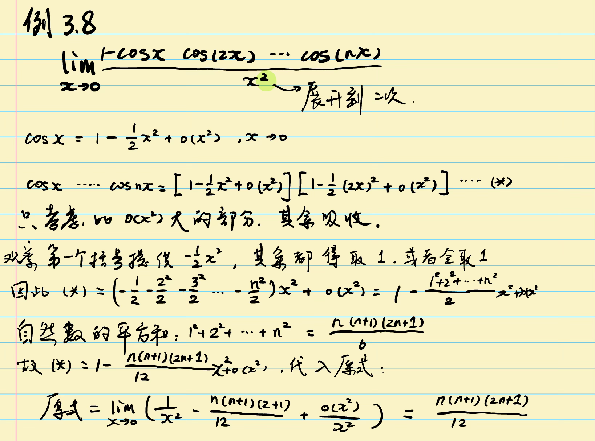

##  无穷怎么办？数学归纳法

$$
\lim_{x \to 0} \frac{x- \sin(\sin(\cdots(\sin x)))}{x^{3}}
$$

> 多次复合的展开，通过递推 吸收余项 化简之后 找关系，提出猜想 数学归纳法证明

展开两次

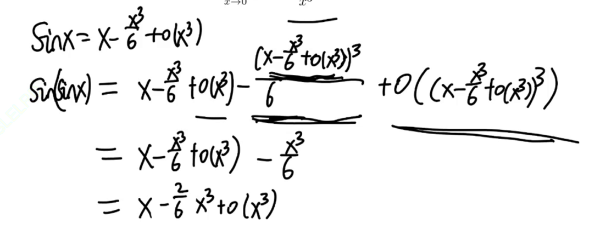

猜想 $\sin \sin \cdots \sin x = x  - \frac{n}{6} x^{3} + o(x^{3})$

使用数学归纳法：

# 余项求和？渐近估计

>[!note]+ 余项求和
> 求和一般出现在：
> - 定积分定义
> - 数列分析 
> - 级数求和
## 一致控制

对于这里的说明，我们在[[从几个极限问题去理解Landau符号]]有更加详细的说明。[[微分学计算#例题二]]

> [!Note] 渐近估计！！！
> 余项或者说是Landau符号，实际上是压缩语言。对于复杂的题目要敢于回到 $\epsilon-\delta$定义，利用  的 任意 性质，和 $n$ 的 无穷 性质，借助 夹逼 或者 回到 定义 作出 极限。这是最基础的渐近估计思想

1. 设 $f$ 在 $0$ 处 可微，$f(0) = 0$，证明：
$$
\lim_{n \to \infty} \sum^{n}_{i=1}f(\frac{i}{n^{2}}) = \frac{f^{\prime}(0)}{2}
$$
> [!attention]+
> 关键在于 不同阶， $\frac{i}{n^{2}} \to 0$ 如果 同阶 可以把 求和 转为 定积分定义计算。而无法回到定积分定义，如果直接使用余项书写必定遇到 $\sum o(\cdot)$ 如何处理的情况，我们无法从压缩语言中得到这里的细节，我们必须要打开他回到定义上说明。这是最常用的估计方法，[[逐项估计]]

---
> 严格方法

由于 $\frac{i}{n^{2}} \to 0, n \to +\infty$，故而在 $x = 0$ 处 展开 $f(x)$: 
$$
f(x) = f'(0)x + o(x) \Leftrightarrow \forall \epsilon, \exists \delta > 0 当 |x| \le \delta, |f(x) - f'(0)x | \le \epsilon |x|
$$
只要 $n > \frac{1}{\delta}$, 有 $|\frac{i}{n^{2}}| < \delta, \forall i = 1,2, \ldots ,n$ 故 $|f(\frac{i}{n^{2}}) - \frac{i}{n^{2}}f'(0)| \le \epsilon \frac{i}{n^{2}}, i =1,2, \ldots ,n$

因此：

$$
(f'(0)-\epsilon )\frac{i}{n^{2}} \le f(\frac{i}{n^{2}}) \le (f'(0)+\epsilon )\frac{i}{n^{2}} \\
$$

求和得到 
利用 $\sum_{k=1}^{n} k = \frac{n+1}{2}$，求和得
$$ 
\begin{equation}\tag{8.9}
(f'(0) - \epsilon)\frac{n+1}{2n} \le \sum_{k=1}^{n} f(\frac{k}{n^2}) \le (f'(0) + \epsilon)\frac{n+1}{2n},
\end{equation}
$$

观察一下，$\frac{n+1}{n}$ 抓大头 极限 为一，$\epsilon$刚好对应极限定义 整理一下：

$$
f'(0) - \epsilon \le \frac{n+1}{2n} \sum _{k=1}^{n} f\left( \frac{k}{n^{2}} \right) \le f'(0) +\epsilon \implies \lim_{ n \to \infty } \frac{2n}{n+1} \sum _{k=1}^{n} f\left( \frac{k}{n^{2}} \right) = f'(0)
$$
或者更加简便的，在8.9 两边取极限$x \to \infty$ ，可以得到：

$$
\frac{f'(0) - \epsilon}{2} <  \varliminf_{ n \to \infty } \sum_{k=1}^n f\left( \frac{k}{n^2} \right) \le \varlimsup_{ n \to \infty } \sum _{k=1}^{n}f\left( \frac{k}{n^{2}}\right) \le \frac{f'(0)+\epsilon}{2} 
$$
因此$\epsilon$  任意可以得到：
$$
\frac{f'(0)}{2} <  \varliminf_{ n \to \infty } \sum_{k=1}^n f\left( \frac{k}{n^2} \right) \le \varlimsup_{ n \to \infty } \sum _{k=1}^{n}f\left( \frac{k}{n^{2}}\right) \le \frac{f'(0)}{2} 
$$
从而

$$
\lim_{ n \to \infty } \sum _{k=1}^{n} f\left( \frac{k}{n^{2}} \right) =  \varliminf_{ n \to \infty } \sum_{k=1}^n f\left( \frac{k}{n^2} \right) = \varlimsup_{ n \to \infty } \sum _{k=1}^{n}f\left( \frac{k}{n^{2}}\right) = \frac{f'(0)}{2} 
$$

因此，由极限的四则运算得到：

$$
\lim_{ n \to \infty } \sum _{k=0}^{n} f\left( \frac{i}{n^{2}} \right) = \frac{f'(0)}{2}
$$
---
> 余项写法

$f(x) = f(x) + f'(x)x + o(x)$,

$$
\begin{align}
\sum f(\frac{i}{n^{2}}) &= \sum[f'(0)\cdot \frac{i}{n^{2}} + o(\frac{i}{n^{2}})] \\
                        &= \frac{f'(0)(n+1)}{2n} + \sum^{n}_{i=1} o(\frac{i}{n^{2}}) \\
                        &= \frac{f'(0)(n+1)}{2n} + \sum o(\frac{1}{n}) \\
                        &= \frac{f'(0)(n+1)}{2n} + n o(\frac{1}{n}) \to \frac{f'(0)}{2}
\end{align}
$$
这里的关键经验在于 是否能够，$\sum _{i=1}^{n} o\left( \frac{i}{n^{2}} \right) = o\left( \sum _{i=1}^{n} \frac{i}{n^{2}} \right)$ , 观察上面的严谨书写，这一步就是把 $\epsilon$ 提取出来。因此： 

>[!Note] 一致控制
>只要我们能够对$\forall k \in \mathbb{R}$ 确定一致$\delta,\epsilon$ 使得 $\frac{i}{n^{2}}$ 落在一致的区间当中我们就可以把 $\epsilon$ 提出来，从而简化书写。因此我们只需要进行这样的判断：
>- 只要 $n > \frac{1}{\delta}$, 有 $|\frac{i}{n^{2}}| < \delta, \forall i = 1,2, \ldots ,n$ 故 $|f(\frac{i}{n^{2}}) - \frac{i}{n^{2}}f'(0)| \le \epsilon \frac{i}{n^{2}}, i =1,2, \ldots ,n$
>这里的关键是把关项数的 $i$ 放缩掉了。 

2. 进一步的我们考察 
$$
\lim_{n \to \infty} (\sum^{n}_{k=1} \frac{1}{\sqrt{n^{2} + k}})^{n}
$$

> tips: 关键在于确定 使用 泰勒 还是 定积分定义: 能不能把 k忽略掉

$$
\begin{equation} \tag{3.6.1}
\lim_{n \to \infty} e^{n \ln \sum \frac{1}{\sqrt{n^{2}+k}}}
\end{equation}
$$

观察 $\sum\frac{1}{\sqrt{n^{2} + k}}= \sum \frac{1}{n} \cdot \frac{1}{\sqrt{  1+\frac{k}{n^{2}}}} < \frac{1}{n} \cdot \frac{1}{1+\frac{1}{n}}$，因此 这意味着我们对 $\forall \epsilon >0, \exists \delta > 0, |x| \le \delta, \dots$
并且我们能够保证$\delta$ 和$k$ 无关。因此，我们直接对Landau符号和求和符号的进行换序。首先我们利用Peano余项，得到渐近估计：

$$
\begin{align}
\sum \frac{1}{\sqrt{n^{2}+ k}}  & = \frac{1}{n} \sum \frac{1}{\sqrt{1+ \frac{k}{n^{2}}} } = \frac{1}{n} \sum \left( 1-\frac{1}{2}\frac{k}{n^{2}}+ O\left( \frac{k^{2}}{n^{4}} \right) \right) \\
 & = \frac{1}{n}\sum\left( 1-\frac{1}{2} \frac{k}{n^{2}}   \right) + O\left( \sum \frac{k^{2}}{n^{4}} \right) \\
 & \overset{\text{吸收掉k<=n的项，他们的阶太小了}}{=}  1- \frac{n+1}{4n^{2}} + O\left( \frac{1}{n^{2}} \right)  \\
 & = 1 - \frac{1}{4n} - \frac{1}{4n^{2}} + O\left( \frac{1}{n^{2}} \right) = 1 - \frac{1}{4n}  + O\left( \frac{1}{n^{2}} \right)
\end{align}
$$

代入式 3.6.1 得到 

$$
up = \lim_{n \to \infty} e^{n \ln[1+(-\frac{1}{4n} + O(\frac{1}{n^{2}}))]} = \lim_{n \to \infty}e^{n [-\frac{1}{4n} + O(\frac{1}{n^{2}})]} = \lim_{n \to \infty}e^{\frac{1}{-4} + n O(\frac{1}{n^{2}})} = \lim_{n \to \infty} e^{-\frac{1}{4} + O(\frac{1}{n})} = e^{-\frac{1}{4}}
$$

使用严格方法：

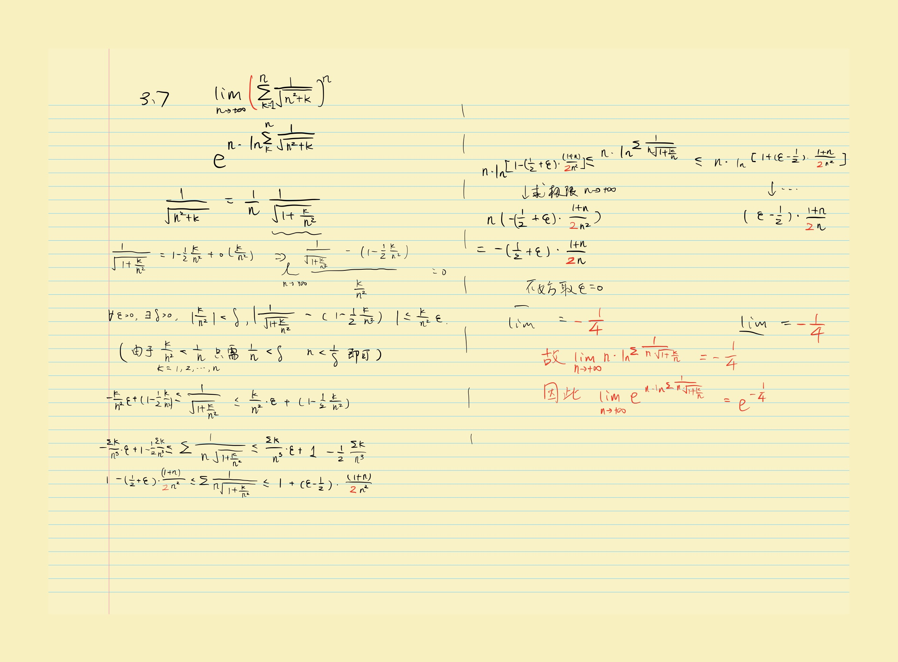

# 保持阶：拉格朗日中值定理

之前我们利用了泰勒展开的余项，得到了函数极限定义中的 绝对值不等式。当面对 函数形式一致的情况时，拉格朗日中值定理也提供了上下限。这种情况使用拉中更为简单。拉中总是能够把阶保持住，书写时我们总是往前写一项到 $n+1$. 他尤其容易出现在[[Stolz定理]]的分母部分。 

拉格朗日中值定理：$f(n+1) - f(n) = (n+1-n)f'(\xi),\xi \in (n+1,n)$ ，事实上我们发现当 $n \to \infty \implies \xi \sim n$ ，因此他能够保持阶。

可能我们会遇到：$f(g(x)) - f(g(x-1)) = (g(x)-g(x-1))f'(\xi),\xi \in (g(x),g(x-1))$   

进一步的 我们会遇到 $f(g(x))- f(x) = (g(x)-x)f'(\theta),\theta \in [x,g(x)]$ ，一般来说我们有：

$$
g(x) \sim x, x \to h
$$

这时候是否要进一步的把 $g(x)$ 展开取决于 $f'(\theta)$ 。

## $g(x) ,g(x-1)$ 
### 例题 3.10

$$
\lim_{n \to \infty}[\sin(\sqrt{n+1}) - \sin(\sqrt{n})]
$$

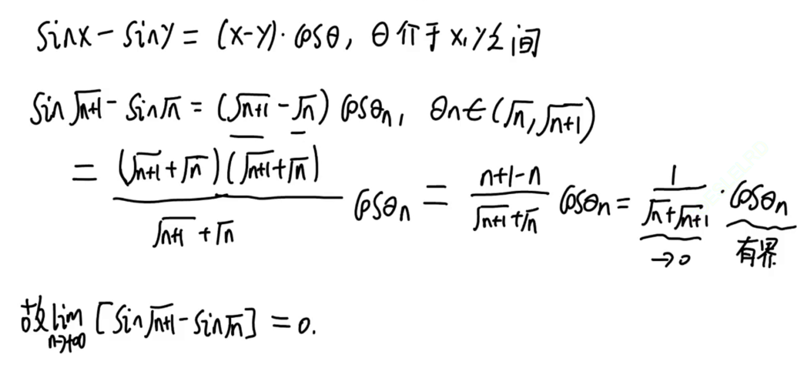

这里还有一个符合并不是常见的 $n+1 - n$ ，这里直接借助 $\cos x$ 的有界性 得出 答案。

### 例题 3.11

$$
\lim_{n \to \infty} n^{2} (\arctan \frac{2024}{n} - \arctan \frac{2024}{n+1})
$$

特征依旧显著。使用拉中：

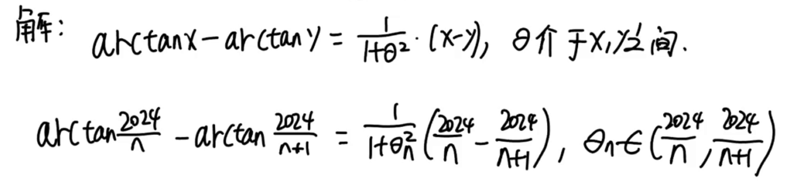

考虑放缩的时候，我们可以先使用 极限的四则运算分离，这样 会更加简单。

$$
\lim_{n \to \infty} \theta_{n} = 0 \rightarrow \lim_{ n \to \infty}\frac{1}{1+\theta^{2}_{n}} = 1
$$

代入到原式中去：

$$
\lim_{n \to \infty} n^{2} \cdot 2024 \cdot (\frac{1}{n} -\frac{1}{n+1})
$$

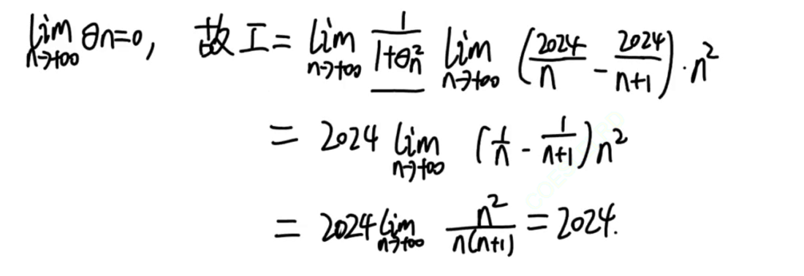

## $n,n-1$ 

这种情况，我们应该能够一眼看出阶的大小。

1. 对 $\alpha \neq 0$, 求 $(n+1)^{\alpha} - n^{\alpha}, n \to \infty$ 等价量

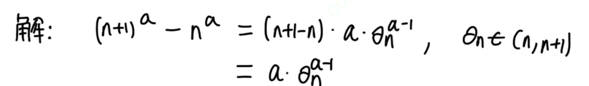

接下来放缩，如果要考虑 $\alpha$ 的范围 大小不好把握。

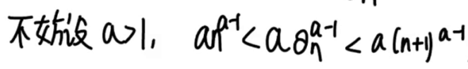

这里 的关键 在于，如果 函数极限定义 会给出一个 任意取 $\epsilon$ 需要我们去思考 如何配置。拉中的结构更为直接，把一边的常数分离出来：

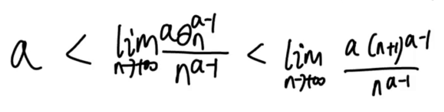

显然 $RHS = a$ 抓大头。那么 上下极限夹逼 可以得到 $\lim_{n \to \infty} \frac{\alpha \theta^{\alpha-1}_{n}}{n^{\alpha-1}} = a$

$$
(n+1)^{a} - n^{a} = a \cdot \theta^{a-1}_{n} = O(n^{a-1}) \Rightarrow (n+1)^{a} - n^{a} \sim a n^{a-1} = (n^{a})'
$$

一般 拉中不改变 阶，意思是 $\theta \sim n$ 直接代入即可。

2. 求 $n\ln n - (n-1)\ln(n-1), n \to \infty$ 等价量
对 $n \ln n$ 求导得到： $\ln \theta + 1$ , $\theta \in (n-1,n),n \to \infty.\theta \sim n$  :

$$
n\ln n - (n-1)\ln(n-1) \sim \ln n
$$
## $g(x),x$ 

$$
\lim_{x \to 0} \frac{\cos(\sin x) - \cos x}{(1-\cos x) \sin ^{2}(x)}
$$

式子 $\cos(\sin x) - \cos x$ 符合拉中结构 

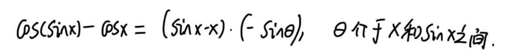

代入，然后 泰勒展开化简 

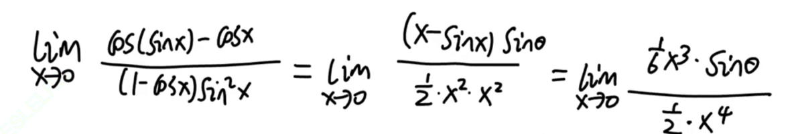

那么 这里关键是 分析 $\sin \theta$ 事实上 $x < \theta < \sin x \rightarrow \theta = O(x) = O(\sin x) \rightarrow \sin \theta \sim  x$ 

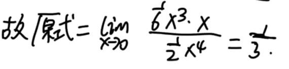

# 迭代法：多阶估计

这是一种思路，在我们能够得到一个渐近展开式，或者分离出 $x$ 之后就能够通过不断代入来改善阶 

- [[求极限的基本办法#^ky59bp]] 这里是 $f(x) = P\left( \frac{1}{x} \right)$ ，可以通过不断地 分离得到 $x$ 的高阶估计。  
- [[数列分析#^ioo59h]]，我们通过 $x_{n} = f(x_{n})$ 不断迭代 

# 定积分定义

## 定积分定义的任意性

^5fae2b

$$
\lim_{ n \to \infty } \frac{1}{n}\sum _{k=i}^{n} f\left( \frac{k}{n} \right) = \int _{0}^{1}f(x)dx
$$
这里我们说明一种，强行替换的思路，他的本质是，细微的差距在最终的求和上可以被省略。

$$\lim_{n \to \infty} \sum_{i=1}^n \frac{1}{n + \frac{i^2+1}{n}}$$
我们可以看到如果 $i^{2} +1$换成了$i^{2}$就是一个标准的定积分定义了。那我们自然的比较他们是否有差异：

$$0 < |\sum_{i=1}^{n} \frac{1}{m + \frac{i^2+1}{n}} - \sum_{i=1}^{n} \frac{1}{m + \frac{i^2}{n}}| \le \sum_{i=1}^{n} \frac{1}{n \left(n + \frac{i^2+1}{n}\right) \left(n + \frac{i^2}{n}\right)}= \sum_{i=1}^{n} \frac{1}{n^3} = \frac{1}{n^2}\to_{0},n\to \infty$$
也就是说，这个1真的没有影响。

$$\lim_{n \to \infty} \sum_{i=1}^{n} \frac{1}{n + \frac{i^2+1}{n}} = \lim_{n \to \infty} \sum_{i=1}^{n} \frac{1}{n + \frac{i^2}{n}}$$
为什么没有影响？我们看到下面的这个式子

$\frac{i}{n} < \frac{\sqrt{i^2+1}}{n} < \frac{i+1}{n}$, 

请回顾定积分定义，实际上$\xi _{i}$ 是任意的第$i$个区间上的点！显然根据上述的式子$\frac{\sqrt{ i^{2}+1 }}{n}$ 在该区间中。于是由定积分定义有
$$\lim_{n \to \infty} \sum_{i=1}^{n} \frac{1}{n + \frac{i^2 + 1}{n}} = \lim_{n \to \infty} \sum_{i=1}^{n} \frac{1}{n} \frac{1}{1 + (\frac{\sqrt{i^2 + 1}}{n})^2} = \int_0^1 \frac{1}{1+x^2} dx = \frac{\pi}{4}$$ ^hh29gi
## 估计求和项的阶以使用定义
$$\lim_{n \to \infty} \sum_{k=1}^{n-1} \left(1 + \frac{k}{n}\right) \sin \frac{k\pi}{n^2}$$

分析 利用泰勒展开式和定积分定义，直接使用定积分定义，将很难分离出代表区间长度的项 $\frac{1}{n}$: 

$$
\begin{align}
\lim_{n \to \infty} \sum_{k=1}^{n-1} (1+\frac{k}{n}) \sin \frac{k\pi}{n^2}  & = \lim_{n \to \infty} \sum_{k=1}^{n-1} (1+\frac{k}{n}) [\frac{k\pi}{n^2} + o(\frac{1}{n^2})] \\
 & = \lim_{n \to \infty} [\pi \sum_{k=1}^{n-1} (1+\frac{k}{n}) \frac{k}{n^2} - \frac{1}{n} + o(\frac{1}{n})] \\
 & = \lim_{n \to \infty} \pi \sum_{k=0}^{n-1} (1+\frac{k}{n}) \frac{k}{n} - \frac{1}{n} = \pi \int_0^1 (1+x)xdx
\end{align}
$$
本题也可参照 [[#一致控制]]中给出的夹逼。一般来说 $i$ 和 $n$ 不同阶我们 就 可以用泰勒公式 把他控制住。我们这里说明部分展开的书写方式。值得注意，$\sin x$ 展开到两次直接带来了一个 $\epsilon$  

实际上我们对$\frac{k\pi}{n^{2}}, \forall \epsilon > 0, \forall k \in \mathbb{N}, \exists \delta _{\epsilon} > 0$ 
$$
x - \epsilon x^{2} \le \sin x \le
$$

# 和式和积分

对于一个和式 $\sum _{n=1} f(n)$ 如果能够被化成 $\sum _{n=1}^{\infty}\int _{f(n)}^{f(n+1)}f(x)dx = \int _{f(1)}^{\infty} f(x) dx$ 的夹逼定理，那么我们就能够通过对积分的计算来得到极限。而支撑我们去探路的往往就是拉格朗日不改变阶的猜想。

这里暂且搁置欧拉麦克劳林公式。我们仅给出放缩形式的不等式：

如果 $f(x)$ 单调递减且非负：

$$
\int _{n}^{n+1} f(x) dx \le f(n) \le \int _{n-1}^{n} f(x) dx
$$

## 拉中阶不变 驱动

设二阶可微函数 $f:[1,+\infty) \to (0,+\infty)$  满足：

$$
f''(x) \le 0, \lim_{ x \to +\infty } f(x) = + \infty
$$

求极限

$$
\lim_{ s \to o^{+} } \sum _{n=1}^{\infty} \frac{(-1)^{n}}{f^{s}(n)}
$$

首先我们需要分析函数形态，我们可以简单的得出，$f \to +oo$ 是一个上凸函数，而上凸函数只能够递增、先递增再递减、递减。但是 $\lim_{ x \to +\infty } f(x) = +\infty$   因此我们可以判断出 $f$ 是一个增函数。

接下来我们就可以专注于求极限了. 事实上我们容易知道

$$\lim_{s\to 0^{+}} \sum_{n=1}^{\infty} \frac{(-1)^n}{f^s(n)} = \lim_{s\to 0^{+}} \sum_{n=1}^{\infty} \frac{1}{f^s(2n)} - \frac{1}{f^s(2n-1)} = \lim_{s\to 0^{+}} -s \sum_{n=1}^{\infty} \frac{f'(0_n)}{f^{s+1}(0_n)}$$

这里 $\theta_n \in (2n-1, 2n), n = 1, 2, ...$ 来自拉格朗日中值定理，然后利用 $f'$ 是递减函数，于是我们由拉格朗日中值定理保持阶梯不变的思想$(\theta \sim 2n), n \to \infty$ ，严格来说，说明即利用夹逼。

$$
\lim_{s\to 0^{+}} \sum_{n=1}^{\infty} \frac{f'(2n-1)}{f^{s+1}(2n-1)} \leq \lim_{s\to 0^{+}} \sum_{n=1}^{\infty} \frac{f'(\theta_n)}{f^{s+1}(\theta_n)} \leq \lim_{s\to 0^{+}} \sum_{n=1}^{\infty} \frac{f'(2n)}{f^{s+1}(2n)} \tag{6.1}
$$

然后分别对 $(6.1)$ 中左边和右边求极限， 所谓拉格朗日中值定理保持阶梯不变的思想，即可提前猜测：

$$
\lim_{s\to 0^{+}} -s \sum_{n=1}^{\infty} \frac{f'(\theta_n)}{f^{s+1}(\theta_n)} = \lim_{s\to 0^{+}} -s \sum_{n=1}^{\infty} \frac{f'(2n)}{f^{s+1}(2n)}
$$

如何严谨的求出$(6.1)$ 两边的极限？我们需要使用和式和积分之间的转换 ，注意到：

和式中每项是 $\frac{f'(n)}{f^{s}(n)}$ ，他的原函数非常显然！，并且我们知道 每项的函数为  ： 

$$ 
\frac{d}{dx} \frac{f'(x)}{f^{s+1}(x)} = \frac{f''(x)f(x) - (s+1)[f'(x)]^{2}}{f^{s+2}(x)} \leq 0
$$

因此我们有：

$$
\frac{1}{2}\sum \int _{2n}^{2n+2} \frac{f'(x)}{f^{s}(x)} dx\le\sum _{n=1}^{\infty} \frac{f'(2n)}{f^{s}(2n)}  \le \frac{1}{2}\sum \int _{2n-2}^{2n} \frac{f'(x)}{f^{s}(x)}dx \tag{6.2}
$$

因此，上式添加一个符号求和就能够得到了：

$$ 
\lim_{s \to 0+} - \frac{s}{2} \int _{2n-2}^{2n} \sum_{n=2}^{\infty} \frac{f'(x)}{f^{s+1}(x)} dx - \lim_{s \to 0+} s\frac{f'(2)}{f^{s+1}(2)} \le \lim_{s \to 0+} -s \sum_{n=1}^{\infty} \frac{f'(2n)}{f^{s+1}(2n)} \le  \lim_{s \to 0+} - \frac{s}{2} \sum_{n=1}^{\infty} \int _{2n}^{2n+2} \frac{f'(x)}{f^{s+1}(x)} dx
$$

LH 我们 从第二项开始放缩，第一项由于有一个 $s$ 控制，因此趋向 $0$ 。直接忽略。（实际上这里我们不放缩的原因就是和RH一致，这样我们只需要说明一次即可。  

$$
\begin{align}
\lim_{s \to 0+} -s \sum_{n=2}^{\infty} \int _{2n-2}^{2n} \frac{f'(x)}{f^{s+1}(x)} dx = \lim_{s \to 0+} \sum_{n=1}^{\infty} \int _{2n}^{2n+2}\frac{f'(x)}{f^{s+1}(x)} dx =  - \lim_{s \to 0+} s \int _{2}^{\infty} \frac{f'(x)}{f^{s+1}(x)} dx  \\
\overset{\text{换元y=f(x)}}{=}  -s\lim_{ s \to o^{+} } \int _{f(2)}^{\infty} \frac{1}{y^{s}+ 1} dy = \lim_{ s \to o^{+} } -s \frac{f(2)^{-s}}{s} = \lim_{ s \to o^{+} } -\frac{1}{f(2)^{s}} =  -1
\end{align}
$$

那么对于$(6.1)$ 式的左边，我们依据 $(6.2)$  可以写出：

$$
\frac{1}{2} \sum _{n=1}^{\infty} \int _{2n-1}^{2n+1} \dots dx \le \sum _{n=1}^{\infty}\dots \le \frac{1}{2} \sum _{n=2} \int _{2n-3}^{2n-1}\dots dx + sf(1)
$$ 
这时候 右边从第二项还是，同样还是说明这里的 $s$ 控制住了有界量直接忽略，不等式两边又归于一致了。因此我们能够得到： 

$$
\lim_{s \to 0^{+}} \sum_{n=1}^{\infty} \frac{(-1)^n}{f^s(n)} = - \frac{1}{2}
$$

