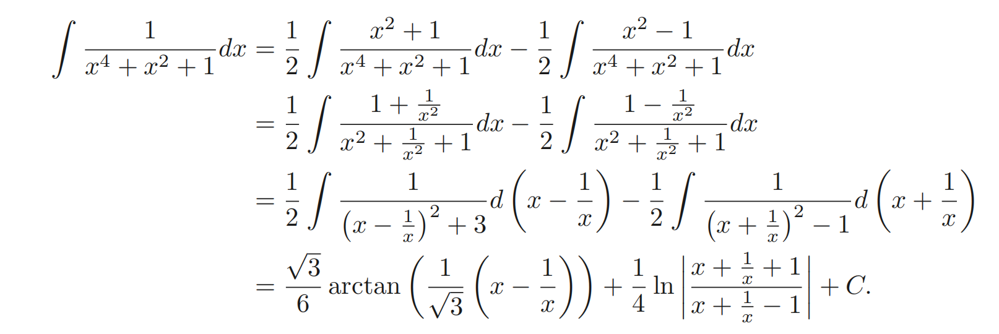

---
tags:
  - cheatsheet
  - 考研
  - math
abstract: 积分是新的基础概念，需要给出详细的说明。
---
## 1.黎曼可积与定义

- **达布可积性准则 (Darboux's Criterion):** 一个有界函数可积的充要条件是，对于任意 $ε > 0$，存在一个划分 $P$，使得上和与下和之差小于 $ε$。这一定理的意义在于，它将可积性与函数在划分上的“总振幅”联系起来，完全脱离了黎曼和定义中对中间点 $ξᵢ$ 的任意选取。

- **黎曼-勒贝格准则 (Riemann-Lebesgue Criterion):** 这是黎曼可积的充要条件。它指出，一个在闭区间上有界的函数是黎曼可积的，当且仅当其不连续点的集合是一个**零测集 (Set of Measure Zero)**。这一定理揭示了黎曼积分的本质与局限：它能够容忍函数的不连续行为，但这种不连续必须在“测度”的意义下是稀疏的。这一深刻的结果不仅为黎曼积分划定了精确的适用范围，也为20世纪初勒贝格测度与积分理论的诞生埋下了伏笔。

对于一个函数 $f(x)$, 我们在区间 $[0,1]$ 上进行说明黎曼和。我们首先进行 $n$ 等分，得到第 $k$ 个片段为 $\left[ \frac{k-1}{n}, \frac{k}{n} \right]$ ，上面的两个判断条件 在于说明，我们能否任意取一个 $f(\xi_k)$ 来代表 整个第 $k$ 个 片段上的值并且的到一致的黎曼和结构。黎曼和被定义为：
$$
S_{p} = \sum ^{n}_{i=1} f(\xi _{k}) \Delta x_{k}
$$
当无穷分割的时候，上述定义的值存在，并且此极限值与分割的划分和点 $\xi _{k}$的选择无关，有题目考查这一概念[[求极限的基本办法#^hh29gi]]。则我们说该函数在区间$[0,1]$上黎曼可积的。这里的可行性判断的关键在于，当$n$ 趋向无穷，片段趋于无穷小的时候，对应的函数值是否能够被 一个 $o(1)$ 控制起来。这是浅显的理解，

>[!important] 黎曼可积的充分条件：
> 1. 闭区间连续
> 2. 闭区间有界 + 有限个间断点
> 3. 闭区间单调函数
> 
> 这三个条件的关键直接指向了 有界！！！。

>[!info]- 单调函数的可积性说明
>单调函数即使存在间断点也一定是黎曼可积的。其根本原因在于，闭区间上的单调函数，其所有间断点必然是跳跃间断点，并且这样的间断点集合最多是可数的。在测度论中，任何可数集的测度都为零。根据黎曼-勒贝格准则，不连续点集为零测集的有界函数是黎曼可积的，因此单调函数必然可积。

## 2. 微积分基本定理

19世纪的分析标准，重新证明并理解牛顿与莱布尼茨凭借直观所发现的逆运算关系。研究的核心问题是在黎曼积分的定义下，这种逆运算关系在何种条件下、在何种程度上成立？

- **第一基本定理 $\frac{d}{dx} \int_{a}^{x} f = f(x)$:** 此定理的核心在于研究**变上限积分 作为函数生成器的性质**。所谓原函数的定义实际上从这里出发。也就是 $\int f(x) dx = F(x) +C,\frac{d F(x)}{dx} = f$
    1. **连续性:** 即便是对于一个仅为黎曼可积的函数 $f$（可能有间断点），其生成的变上限积分函数 $Φ(x)$ 必然是连续的，甚至是绝对连续的。这里我们可以衍生出来，由于变上限积分作为一个原函数，并且具有连续的性质，其他的原函数是变上限积分加上一个积分常数，故而我们可以声明，原函数连续的性质。
    2. **微分的恢复:** 当对 $f$ 施加更强的条件——在点 $x₀$ 连续时（非间断点），$Φ(x)$ 就在该点可微，且 $Φ'(x₀) = f(x₀)$。
- **第二基本定理 ($∫ F' = F(b) - F(a)$):** 此定理将一个全局量（定积分）与一个局部量的边界值（原函数在端点的值）联系起来。
    1. 它为将积分计算转化为寻找原函数。
    2. **对偶关系的局限性:** 对此定理适用范围的深入研究，暴露了黎曼积分框架的不足。数学家构造出了这样的函数（如Volterra函数），它处处可微，其导函数有界，但导函数却不是黎曼可积的（原函数存在，但是无法计算黎曼积分，我们能够写出等式右边的内容，但是定义上左边不存在）。在这种情况下，第二基本定理失效。这说明，在黎曼积分的框架内，**一个函数的导函数不一定比原函数有更好的可积性**。微分与积分的对偶关系是不完全的，这一矛盾成为推动积分理论（向勒贝格积分）发展的直接动力。

>[!note]+ **附注：原函数的存在性判定**
>
>需要注意一个函数 $f(x)$ 是否存在原函数，与其黎曼可积性并没有必然的关系。
> 
> - 充分条件：连续性
>函数 $f(x)$ 在区间 $I$ 上存在原函数的最重要且最常用的充分条件是其在该区间上的连续性。依据微积分第一基本定理，若 $f$ 连续，则其变上限积分 $F(x) = \int _{a}^{x} f(t) dt$ 不仅存在，而且可微，其导数恰为 $f(x)$。因此，连续性直接保证了原函数的存在性，并给出了一个构造性的证明。
> 
> - 必要条件：介值性 (达布定理)
>一个函数若要成为某个函数的导函数，其自身必须满足介值性。此结论由达布定理 (Darboux's Theorem) 保证，即任何导函数都具备介值性质，它不能“跳过”任何中间值。因此，任何包含第一类间断点（如跳跃间断点或可去间断点）的函数，必然破坏介值性，故必不存在原函数。例如，阶梯函数虽然是黎曼可积的，但因其包含跳跃间断点，所以它没有原函数。
 
> [!attention]+ 存在性与可积性的分野
>上述准则清晰地揭示了原函数存在性与黎曼可积性是两个独立的概念：
>   1. **可积但无原函数**：如上所述的阶梯函数。
>   2. **有原函数但不可积**：如前文提到的Volterra函数的导函数，它满足介值性（作为导函数），但其不连续点集不是零测集，故非黎曼可积。
> 这一分野深刻地反映了微分算子与黎曼积分算子之间对偶关系的不完备性。
## 3. 反常积分
反常积分是定积分概念的推广，用于处理积分区间无穷或被积函数在积分区间内无界的情况。其定义本质上是一个极限过程：
- $\int_a^\infty f(x) dx \triangleq \lim_{b \to \infty} \int_a^b f(x) dx$
- 若 $f(x)$ 在 $b$ 点无界, $\int_a^b f(x) dx \triangleq \lim_{c \to b^-} \int_a^c f(x) dx$
反常积分是否收敛是核心。收敛性的一个充分条件是：绝对收敛

如果反常积分 $\int |f(x)| dx$ 收敛，则反常积分 $\int f(x)dx$ 收敛。比如积分 $\int_1^\infty \frac{\sin x}{x^2} dx$ 的收敛性。
直接处理 $\sin x$ 的振荡行为很困难。但我们可以考察其绝对值：
$$ \left| \frac{\sin x}{x^2} \right| \le \frac{1}{x^2} $$
我们知道 $\int_1^\infty \frac{1}{x^2} dx$ 是收敛的。根据比较判别法，$\int_1^\infty \left| \frac{\sin x}{x^2} \right| dx$ 收敛。因此，根据绝对收敛判别法，原积分 $\int_1^\infty \frac{\sin x}{x^2} dx$ 必然收敛。[[反常积分敛散性]]

另外我们需要说明 当给定了一个 积分 $\int _{0}^{1} f(x)dx$，我们不能直接先入为主的说明他是定积分。他很有可能是瑕积分，也就是有积分区间边界函数无界。

我们可以给出一个满足定积分定义充分条件：$f(x)$单调并且$\int _{0}^{1} f(x) dx$收敛。也就是说
$$
\lim_{ n \to \infty } \sum _{k=0}^{n-1} \frac{1}{n} f\left( \frac{k}{n} \right) = \int _{0}^{1}f(x)dx
$$

这个定理并没有试图将一个反常积分“变成”定积分。它的作用是说：这个反常积分（广义积分）符合条件，所以使用**黎曼和极限**来计算。

对于变上限积分，一个想法是变形为无穷个定积分相加 也就是 数列的求和模式，通过使用stolz来得出所求式的极限。[[Stolz定理#^nvhkt0|变上限积分的Stolz]]
## 4. 积分的运算性质：积分算子的代数结构

- **线性性质 ($∫(αf + βg) = α∫f + β∫g$):** 
- **区间可加性 ($\int _{a}^{c}= \int _{a}^{b} + \int _{b}^{c}$):** 此性质是积分作为一种“测度”思想的雏形。它保证了积分的定义与区间的几何分解相容，是未来将积分概念从简单区间推广到更复杂集合（在勒贝格理论中）的逻辑基础。
- 在复杂题目中要从积分运算的本质：求面积入手。利用周期函数[[Stolz定理#^nvhkt0|变上限积分转为定积分累加通过周期化简]]、对称性的方式帮助我们解决复杂的题目。
## 5. 积分的计算方法

在确认了原函数的存在性之后，其显式计算（求不定积分）则依赖于一套源于微分法则的逆运算技巧。这些方法的核心目标是将一个复杂的被积函数转化为一个或多个基本积分形式的组合。
### 5.1 换元积分法 

#### **第一类换元法 (凑微分法)** 

其形式为 $\int f(g(x))g'(x) dx = \int f(u) du$，其中 $u = g(x)$。此方法的本质是在被积函数中**识别**出 $g(x)$ 与其导数 $g'(x)$ 的乘积结构，通过变量代换 $u=g(x)$，将复杂的复合函数积分转化为对 $f(u)$ 的简单积分。它是一种逆向应用链式法则的模式识别过程。
#### **第二类换元法** 

其形式为 $x = φ(t)$，则 $\int f(x) dx = \int f(φ(t))φ'(t) dt$。与第一类换元法不同，此方法是**主动构造**一个变量代换 $x = φ(t)$（要求 $φ(t)$ 单调可导），以期简化被积函数的代数结构。进一步我们在[[三角换元]] 中说明。这里还有一些三角变换需要熟知 [[三角恒等变换]]
### 5.2 分部积分法

理论基础： 乘积求导的逆运算。由 $(u(x)v(x))' = u'(x)v(x) + u(x)v'(x)$，两边积分并整理可得
$$\int u(x)v'(x) dx = u(x)v(x) - \int v(x)u'(x) dx$$
这里我们要说明，分部积分能够非常优美的改变积分函数的阶。当我们尝试直接操作不行的时候就可以使用分部积分改善阶到我们期望的部分。在定积分运算中也常常使用。

同时需要说明，分部积分法同时适用于我们的变限积分。我们在
- [[微分学计算#例题四]] 当中就使用 分部积分改善了阶，并且说明“遇事不决，分部积分”
- 改善阶是对“反对幂指三”的进一步理解。
### 5.3 定积分的换元积分法

这里我们需要说明一点，这里的 换元积分法 和不定积分的换元积分法的定理和方法并不一致。我们将被积函数和积分区域隐射之后将不再回到我初始函数，这与不定积分换元不同（不定积分的换元要求双向的反函数，单调的条件，比如我们对常见的 [[三角换元]]的思考），同时更换积分变量和积分 ^5c3e31

接下来这里我们讨论一些常见的有一点复杂不定积分：
#### 根式相积
$$
\int \frac{1}{\sqrt{ x-a }\sqrt{ b-x }}dx
$$
一次的根号，但是观察两个根号相乘，我们期望分离出常数，把他们凑成一对。这里可以使用换元来辅助。我们直接让 $(x-a) = y(b-x)$，当然二次的 $y^{2}$ 也可以的，但是分离起来复杂，我们把二次保留着积分时候再运算。那么我们就得到了

$$
\int \frac{d\left( \frac{yb+a}{1+y} \right)}{\sqrt{ y }\left( b-\frac{yb+a}{1+y} \right)} = \int \frac{dy}{\sqrt{ y }(y+1)}
$$
我们继续处理根号，$y = z^{2}$ 这样我们继续得到了：
$$
2 \int \frac{1}{z^{2}+1} dz = 2 \arctan z + c = 2 \arctan \sqrt{ y } + c = 2 \arctan\left( \sqrt{ \frac{x-a}{b-x} } \right) + c
$$
#### 杂例 

1.因式分解：
$$
\int \frac{1}{x^{4}+x^{2}+1}dx
$$
>[!note]- 一个比较巧妙但复杂的分解
> $$\int \frac{1}{x^4 + x^2 + 1} dx = \frac{1}{2} \int \frac{x^2 + 1}{x^4 + x^2 + 1} dx - \frac{1}{2} \int \frac{x^2 - 1}{x^4 + x^2 + 1} dx$$
> 

分母 $x^4 + x^2 + 1$ 我们可以因式分解为： $$x^4 + x^2 + 1 = x^4 + 2x^2 + 1 - x^2 = (x^2 + 1)^2 - x^2$$这样就可以使用平方差公式： 
$$x^4 + x^2 + 1 = (x^2 + 1 - x)(x^2 + 1 + x) = (x^2 - x + 1)(x^2 + x + 1)$$
裂项为待定系数：
$$\frac{1}{(x^2 - x + 1)(x^2 + x + 1)} = \frac{Ax + B}{x^2 - x + 1} + \frac{Cx + D}{x^2 + x + 1}$$
- $A + C = 0$
- $B - A + D + C = 0$
- $A - B + C + D = 0$
- $B + D = 1$

$$\frac{1}{x^4 + x^2 + 1} = \frac{1/2}{x^2 - x + 1} + \frac{1/2}{x^2 + x + 1}$$

现在计算两个积分： $$\int \frac{1}{x^2 - x + 1}dx \quad \text{和} \quad \int \frac{1}{x^2 + x + 1}dx$$

对于这类形如 $\int \frac{1}{x^2 + px + q}dx$ 的积分，我们需要配方到 $\arctan$ 的积分上：

- $x^2 - x + 1 = (x - \frac{1}{2})^2 + \frac{3}{4}$
- $x^2 + x + 1 = (x + \frac{1}{2})^2 + \frac{3}{4}$

$$\int \frac{1}{x^4 + x^2 + 1}dx = \frac{1}{\sqrt{3}}\arctan\frac{2x-1}{\sqrt{3}} + \frac{1}{\sqrt{3}}\arctan\frac{2x+1}{\sqrt{3}} + C$$
2.直接猜出积分：
对于一些特征非常明显的积分元素，我们应该大胆猜测再求道小心求证。计算$$\int \frac{e^{-\sin x} \sin(2x)}{(1-\sin x)^2} dx.$$
有指数函数，分母有平方，我们很容易想到 $e^{-\sin x}$ 在求导过程中保持不变，分母有二次，所以原函数应该有 $\frac{e^{-\sin x}}{1-\sin x}$，这样我们求个导，可以验算到 差一个常数2，原式等于：
$$
\frac{2 e^{-\sin x}}{1-\sin x} + C
$$
## 7.定积分计算
这里我们需要积累[[区间再现恒等式]]的方法，解决特殊的定积分计算。
$$
\int _{a}^{b}f(x) dx = \int _{a}^{b} f(a + b-x) dx = \frac{1}{2} \int _{a}^{b}f(x) + f(a+b-x) dx = \frac{1}{2} \int _{a}^{\frac{a+b}{2}}f(x)+f(a+b-x)dx 
$$
$$
\begin{align}
\int _{0}^{+\infty} f(x) dx  & = \int _{0}^{1}f(x)dx + \int _{1}^{+\infty}f(x)dx  \\
 & = \int _{0}^{1}f(x) dx + \int _{0}^{1}f\left( \frac{1}{x} \right)d\left( \frac{1}{x}  \right) = \int _{0}^{1}f(x)+\frac{f\left( \frac{1}{x} \right)}{x^{2}} dx
\end{align}
$$
这里插入[[收敛与有界]]的辨析，常看常新。另外我们还有[[傅汝兰尼积分]]来帮助我们解决复杂的定积分计算。
另外还有级数展开方法，级数展开方法往最为深刻, 所以考察的几率较低, 因此先[[搁置]]
## 8.反常积分敛散性
我们需要积累一些[[反常积分敛散性的抽象结果]]

